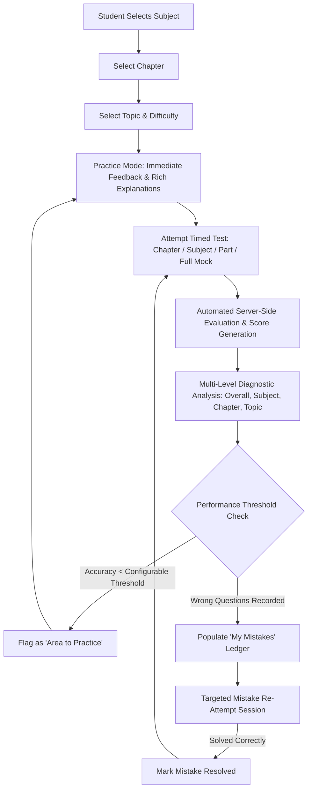
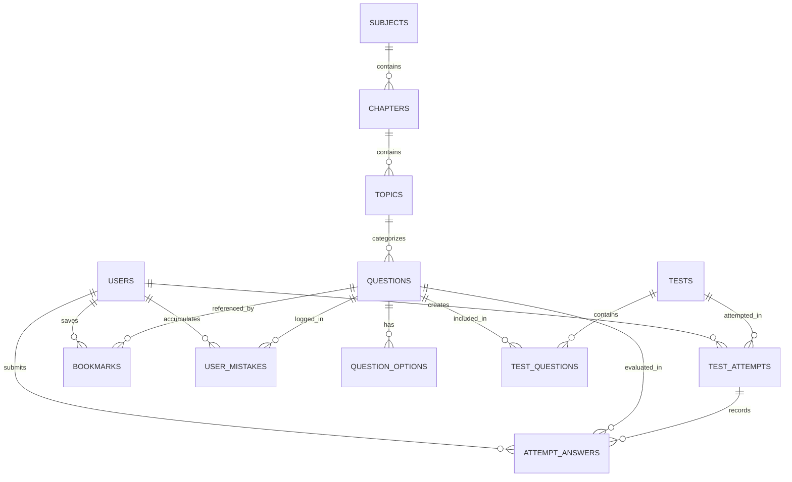
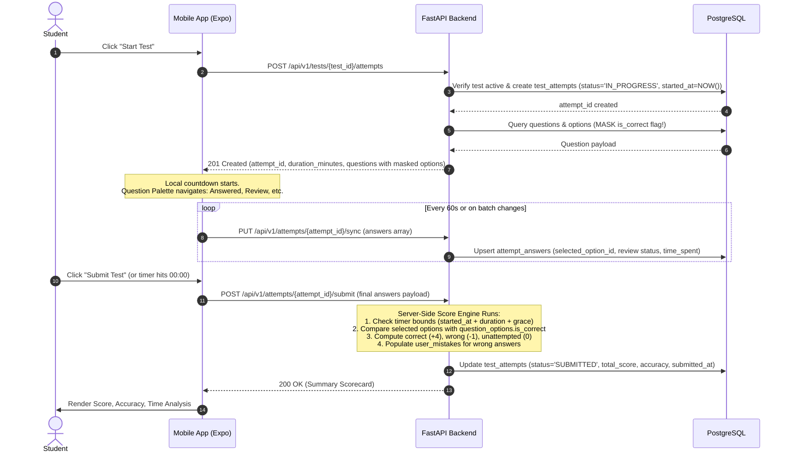
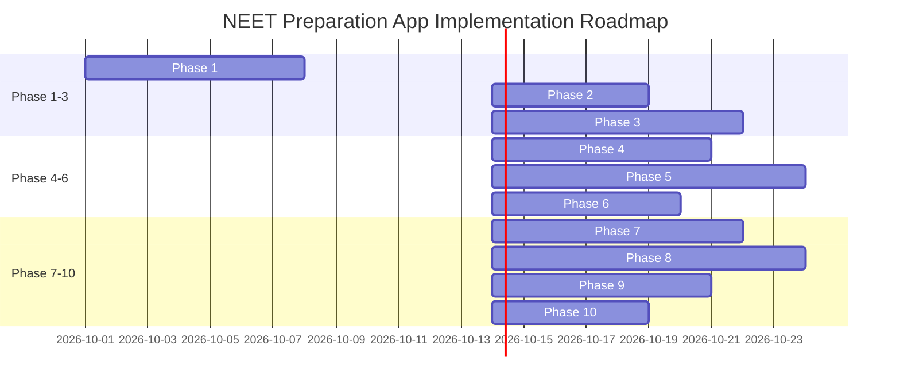

# NEET PREPARATION APP — MASTER PRODUCT & TECHNICAL BLUEPRINT

**Document Version:** 1.0.0  
**Status:** Approved Architecture Draft  
**Author:** Principal Product & Systems Architect  
**Core Motto:** *Practice. Test. Analyze. Improve.*  

---

## 1. Executive Summary

The **NEET Preparation App** is a specialized, high-yield digital learning and assessment platform engineered exclusively for National Eligibility cum Entrance Test (NEET-UG) aspirants. Unlike generic ed-tech applications and disorganized PDF/question repositories, this platform is built around a single, scientifically grounded pedagogical feedback loop:

$$\text{Practice} \longrightarrow \text{Test} \longrightarrow \text{Analyze} \longrightarrow \text{Target Weak Areas} \longrightarrow \text{Practice} \longrightarrow \text{Retest} \longrightarrow \text{Mastery}$$

The application provides a strict taxonomy: **Subject $\rightarrow$ Chapter $\rightarrow$ Topic $\rightarrow$ Difficulty $\rightarrow$ Question Type**. It couples this practice tree with a configurable, tamper-proof **Test Engine** capable of running Chapter Tests, Subject Tests, Part Tests, and Full-Length Mock Tests adhering strictly to dynamic NTA (National Testing Agency) marking and time schemes. 

By eliminating client-side evaluation, isolating scoring algorithms to the backend, tracking question-level cognitive latency, and routing failed attempts into an automated **"My Mistakes"** remediation pipeline, the platform transforms raw question-solving into measurable, objective rank improvement.

---

## 2. Problem Statement Analysis

### 2.1 The Problem
Over 2 million students appear for NEET-UG annually competing for fewer than 100,000 MBBS seats. While question banks and test papers are abundantly available, students fail to achieve score breakthroughs because their preparation is unstructured, passive, and disjointed.

### 2.2 Current Workflow & Pain Points
| Stage | Current Aspirant Workflow | Core Pain Point | Root Cause |
|---|---|---|---|
| **Practice** | Solving questions from bulky paper guides or Telegram PDFs. | Inability to filter by micro-topic or specific difficulty; no immediate feedback. | Flat, unindexed content delivery without a granular taxonomy. |
| **Testing** | Taking offline tests or basic online quizzes. | Client-side score manipulation, timer desynchronization, rigid test patterns. | Inflexible test engines with hardcoded rules and unverified client scoring. |
| **Analysis** | Manually checking answer keys, totaling marks. | Only aggregate scores are observed; chapter/topic-level vulnerabilities remain hidden. | Lack of normalized question-attempt attribution data models. |
| **Remediation** | Circling mistakes in physical books or forgetting them entirely. | Mistake patterns repeat in major exams; wrong questions are rarely systematically retested. | Absence of an automated mistake ledger that enforces re-solving until mastery. |

### 2.3 Proposed Solution & Core Product Loop
The proposed platform unifies curated content delivery, exam simulation, and granular diagnostic analytics into an integrated mobile and web architecture.



---

## 3. Target Users & Personas

### 3.1 Primary Users (Students)
1. **Class 11 Aspirants:** Focus on foundation building; require granular chapter-wise and topic-wise practice; take Chapter and Part tests.
2. **Class 12 Aspirants:** Balancing board syllabus and NEET; require Part tests and revision tests bridging Class 11 and 12.
3. **NEET Repeaters / Droppers:** High-velocity practice, speed optimization, full-length mock simulations, and aggressive mistake remediation.
4. **Self-Study Aspirants:** Rely entirely on rich explanations, structured roadmaps, and objective performance metrics without coaching dependencies.

### 3.2 Secondary Users (Admins & Content Team)
1. **Subject Matter Experts (SMEs):** Input questions, verify LaTeX/formulas, categorize by topic/difficulty, author multi-step explanations.
2. **Test Administrators:** Configure test templates, curate questions, set marking schemes (+4/-1 or customized), publish schedules.
3. **System Administrators:** Manage user access, monitor API health, view platform telemetry and aggregate performance data.

---

## 4. User Pain Points & Direct Solutions

| # | Aspirant Pain Point | Solution Implemented in System |
|---|---|---|
| 1 | "I practice 100 questions but don't know which specific subtopic I am failing in." | Hierarchical tagging (Subject $\rightarrow$ Chapter $\rightarrow$ Topic) with accuracy breakdowns computed down to the topic level. |
| 2 | "I repeat the exact same errors in the final exam that I made months ago." | Automated **"My Mistakes"** engine that logs every incorrect attempt with attempt counters and requires clean re-solving to resolve. |
| 3 | "Online apps calculate marks on the phone; cheaters ruin test rank accuracy." | 100% server-side evaluation. Answers are sent as raw events; the backend scores, audits timers, and persists results. |
| 4 | "NTA changes pattern (e.g., Section A/B optional questions), and apps break." | Dynamic JSON-based `TestRule` configuration stored in database; no hardcoded exam rules in client applications. |
| 5 | "Apps say 'You are poor in Physics' without actionable data." | Objective, threshold-driven **"Areas to Practice"** using configurable statistical boundaries (e.g., $<60\%$ accuracy with $\ge 15$ attempts). |

---

## 5. Product Objectives

### 5.1 Primary Objective
Engineer a robust, low-latency, cross-platform NEET preparation system that enables students to practice questions hierarchically, take timed mock tests, and systematically improve accuracy through data-driven performance diagnostics.

### 5.2 Functional Objectives
- Systematic 4-tier question bank (Physics, Chemistry, Biology).
- Dual interaction modes: **Practice Mode** (instant explanation, untimed/timed self-paced) and **Test Mode** (NTA-style exam conditions, countdown timer, question palette).
- Server-side scoring engine supporting positive and negative marking.
- Diagnostic analytics breakdown across Subject, Chapter, and Topic dimensions.
- Persistent remediation modules: **"My Mistakes"** and **"Bookmarks"**.
- Role-based Admin Portal for content authoring and test orchestration.

### 5.3 Technical Objectives
- **Sub-100ms** API response times for question fetching and submission.
- **Data Integrity:** Foreign key integrity ensuring no orphaned questions, topics, or attempts.
- **Zero Client Trust:** Timer verification, answer masking, and score calculation strictly isolated to backend services.
- **Horizontal Scalability:** Stateless backend services ready for containerized autoscaling.

---

## 6. Core Features & MVP Scope

### 6.1 Included in MVP (Scope In)
- **Authentication & Profiles:** JWT-based signup/login, class selection (Class 11, 12, Repeater), target NEET year.
- **Hierarchical Question Bank:** Subject $\rightarrow$ Chapter $\rightarrow$ Topic with Difficulty levels (Easy, Medium, Hard).
- **Single-Correct MCQ Engine:** 4 options, LaTeX/formula support, rich markdown explanations, source/year metadata.
- **Test Engine:**
  - Chapter Tests, Subject Tests, Part Tests, Full Mock Tests.
  - Interactive Question Palette: *Answered*, *Unanswered*, *Marked for Review*, *Answered & Marked for Review*.
  - Strict countdown timer with automatic force-submission on expiration.
- **Performance Analytics:** Overall accuracy, subject-wise scores, chapter-wise accuracy radar, time spent per question.
- **Remediation Tools:**
  - *My Mistakes:* Filterable by Subject/Chapter; tracks attempt count and resolution status.
  - *Bookmarks:* One-tap saving with custom filtering.
- **Admin Management Panel:** Full CRUD for Taxonomy, Questions, and Tests with real-time validation.

### 6.2 Deferred to Post-MVP (Scope Out)
- Assertion-Reason, Matrix Match, Statement-I/II multi-format questions (database schema is pre-architected to accommodate them).
- Daily Streaks and Gamified Badges.
- Global Percentile / Live Leaderboards (to avoid early premature optimization before user density is achieved).
- AI study assistant / automated question synthesis.
- Offline SQLite sync (MVP requires active network connectivity).

---

## 7. Complete System Architecture & ERD

### 7.1 Database Entity Relationship Diagram (PostgreSQL)



### 7.2 Relational Schema Specifications

#### 1. `users`
- `id` (UUID, PK, indexed)
- `email` (VARCHAR(255), Unique, Not Null)
- `hashed_password` (VARCHAR(255), Not Null)
- `full_name` (VARCHAR(150), Not Null)
- `target_year` (SMALLINT, Not Null)
- `student_grade` (VARCHAR(20), Enum: 'CLASS_11', 'CLASS_12', 'REPEATER')
- `role` (VARCHAR(20), Default 'STUDENT', Enum: 'STUDENT', 'ADMIN', 'CONTENT_CREATOR')
- `is_active` (BOOLEAN, Default True)
- `created_at` (TIMESTAMPTZ, Default NOW())
- `updated_at` (TIMESTAMPTZ, Default NOW())

#### 2. `subjects`, `chapters`, `topics` (Taxonomy Tree)
- **`subjects`**: `id` (INT, PK), `name` (VARCHAR(50), Unique), `slug` (VARCHAR(50)), `display_order` (INT)
- **`chapters`**: `id` (INT, PK), `subject_id` (INT, FK $\rightarrow$ `subjects.id`), `name` (VARCHAR(150)), `slug` (VARCHAR(150)), `display_order` (INT)
- **`topics`**: `id` (INT, PK), `chapter_id` (INT, FK $\rightarrow$ `chapters.id`), `name` (VARCHAR(150)), `slug` (VARCHAR(150)), `display_order` (INT)

#### 3. `questions` & `question_options`
- **`questions`**:
  - `id` (UUID, PK)
  - `topic_id` (INT, FK $\rightarrow$ `topics.id`, Indexed)
  - `question_text` (TEXT, Not Null)
  - `question_type` (VARCHAR(30), Default 'SINGLE_CHOICE')
  - `difficulty` (VARCHAR(20), Enum: 'EASY', 'MEDIUM', 'HARD')
  - `explanation` (TEXT, Not Null)
  - `image_url` (VARCHAR(500), Nullable)
  - `source` (VARCHAR(100), Nullable - e.g., 'NEET_OFFICIAL', 'NCERT_EXEMPLAR')
  - `year` (SMALLINT, Nullable)
  - `is_active` (BOOLEAN, Default True)
  - `created_at`, `updated_at`
- **`question_options`**:
  - `id` (UUID, PK)
  - `question_id` (UUID, FK $\rightarrow$ `questions.id` ON DELETE CASCADE, Indexed)
  - `option_key` (VARCHAR(1), e.g., 'A', 'B', 'C', 'D')
  - `option_text` (TEXT, Not Null)
  - `is_correct` (BOOLEAN, Not Null)
  - `image_url` (VARCHAR(500), Nullable)

#### 4. `tests` & `test_questions`
- **`tests`**:
  - `id` (UUID, PK)
  - `title` (VARCHAR(200), Not Null)
  - `test_type` (VARCHAR(30), Enum: 'CHAPTER', 'SUBJECT', 'PART', 'FULL_MOCK')
  - `duration_minutes` (INT, Not Null)
  - `total_marks` (INT, Not Null)
  - `positive_marks_per_q` (NUMERIC(4,2), Default 4.00)
  - `negative_marks_per_q` (NUMERIC(4,2), Default 1.00)
  - `is_published` (BOOLEAN, Default False)
  - `metadata_rules` (JSONB - e.g., sections, optional questions count)
  - `created_at`, `updated_at`
- **`test_questions`**:
  - `id` (UUID, PK)
  - `test_id` (UUID, FK $\rightarrow$ `tests.id` ON DELETE CASCADE, Indexed)
  - `question_id` (UUID, FK $\rightarrow$ `questions.id`, Indexed)
  - `section_name` (VARCHAR(50), Default 'Section A')
  - `order_index` (INT, Not Null)
  - *Unique Constraint: (`test_id`, `question_id`)*

#### 5. `test_attempts` & `attempt_answers`
- **`test_attempts`**:
  - `id` (UUID, PK)
  - `user_id` (UUID, FK $\rightarrow$ `users.id`, Indexed)
  - `test_id` (UUID, FK $\rightarrow$ `tests.id`, Indexed)
  - `started_at` (TIMESTAMPTZ, Default NOW())
  - `submitted_at` (TIMESTAMPTZ, Nullable)
  - `status` (VARCHAR(20), Enum: 'IN_PROGRESS', 'SUBMITTED', 'EXPIRED')
  - `total_questions` (INT, Default 0)
  - `attempted_count` (INT, Default 0)
  - `correct_count` (INT, Default 0)
  - `wrong_count` (INT, Default 0)
  - `unattempted_count` (INT, Default 0)
  - `total_score` (NUMERIC(6,2), Default 0.00)
  - `accuracy_percentage` (NUMERIC(5,2), Default 0.00)
  - `time_taken_seconds` (INT, Default 0)
- **`attempt_answers`**:
  - `id` (UUID, PK)
  - `attempt_id` (UUID, FK $\rightarrow$ `test_attempts.id` ON DELETE CASCADE, Indexed)
  - `question_id` (UUID, FK $\rightarrow$ `questions.id`, Indexed)
  - `selected_option_id` (UUID, FK $\rightarrow$ `question_options.id`, Nullable)
  - `is_marked_for_review` (BOOLEAN, Default False)
  - `is_correct` (BOOLEAN, Nullable)
  - `marks_obtained` (NUMERIC(4,2), Default 0.00)
  - `time_spent_seconds` (INT, Default 0)

#### 6. `bookmarks` & `user_mistakes`
- **`bookmarks`**:
  - `id` (UUID, PK)
  - `user_id` (UUID, FK $\rightarrow$ `users.id`, Indexed)
  - `question_id` (UUID, FK $\rightarrow$ `questions.id`, Indexed)
  - `created_at` (TIMESTAMPTZ, Default NOW())
  - *Unique Constraint: (`user_id`, `question_id`)*
- **`user_mistakes`**:
  - `id` (UUID, PK)
  - `user_id` (UUID, FK $\rightarrow$ `users.id`, Indexed)
  - `question_id` (UUID, FK $\rightarrow$ `questions.id`, Indexed)
  - `failure_count` (INT, Default 1)
  - `last_attempted_at` (TIMESTAMPTZ, Default NOW())
  - `is_resolved` (BOOLEAN, Default False)
  - *Unique Constraint: (`user_id`, `question_id`)*

---

## 8. API Architecture & Lifecycle

All APIs adhere to standard REST semantics, prefixing `/api/v1`. Authentication is validated via `Bearer <JWT_ACCESS_TOKEN>`.

### 8.1 Core API Endpoints

| Domain | Method | Endpoint | Access | Purpose |
|---|---|---|---|---|
| **Auth** | `POST` | `/api/v1/auth/signup` | Public | Register new student profile |
| **Auth** | `POST` | `/api/v1/auth/login` | Public | Authenticate and issue JWT token pair |
| **Taxonomy** | `GET` | `/api/v1/taxonomy/tree` | Student/Admin | Fetch Subjects $\rightarrow$ Chapters $\rightarrow$ Topics hierarchy |
| **Practice** | `GET` | `/api/v1/practice/questions` | Student | Fetch paginated questions by topic/difficulty |
| **Practice** | `POST` | `/api/v1/practice/submit-answer` | Student | Validate single practice question, return explanation |
| **Tests** | `GET` | `/api/v1/tests` | Student | List active tests with filters (Chapter, Subject, Full) |
| **Tests** | `POST` | `/api/v1/tests/{test_id}/attempts` | Student | Initialize attempt, lock start time, stream questions |
| **Tests** | `PUT` | `/api/v1/attempts/{attempt_id}/sync` | Student | Periodic sync of selected answers & review flags |
| **Tests** | `POST` | `/api/v1/attempts/{attempt_id}/submit` | Student | Finalize test, calculate score server-side |
| **Results** | `GET` | `/api/v1/attempts/{attempt_id}/result` | Student | Comprehensive score card, accuracy, speed stats |
| **Analytics** | `GET` | `/api/v1/analytics/dashboard` | Student | Overall performance summary and weak area diagnosis |
| **Remediation** | `GET` | `/api/v1/mistakes` | Student | List failed questions with filter by chapter |
| **Remediation** | `POST` | `/api/v1/mistakes/{question_id}/resolve` | Student | Verify re-attempt and mark resolved if correct |
| **Bookmarks** | `POST` | `/api/v1/bookmarks/{question_id}` | Student | Toggle bookmark status |
| **Admin** | `POST` | `/api/v1/admin/questions` | Admin | Create single question with validated options |
| **Admin** | `POST` | `/api/v1/admin/tests` | Admin | Assemble and publish test configuration |

### 8.2 Test Attempt Lifecycle Walkthrough



---

## 9. Weak Area Identification & Remediation Logic

### 9.1 Objective Diagnostic Framework
To avoid arbitrary and pseudoscience assertions, the system classifies academic health based on configurable mathematical thresholds tied directly to question volume:

- **Minimum Sample Size:** Minimum 15 questions attempted within a chapter before an analytical status is assigned (otherwise marked as `"INSUFFICIENT_DATA"`).
- **Thresholds (Stored in System Settings):**
  - **Weak Area ("Area to Practice"):** $\text{Accuracy} < 60.0\%$
  - **Needs Practice:** $60.0\% \le \text{Accuracy} \le 75.0\%$
  - **Strong Area:** $\text{Accuracy} > 75.0\%$

### 9.2 "My Mistakes" Auto-Remediation Workflow
1. When a test is evaluated or practice answer fails, an entry in `user_mistakes` is upserted with `is_resolved = False` and `failure_count += 1`.
2. The student visits **"My Mistakes"**, filtered by Subject/Chapter.
3. The student solves the question in a focused retry mode.
4. **Resolution Rule:** If answered correctly on re-attempt, `is_resolved` switches to `True`. If failed again, `failure_count` increments and the question remains active in the queue.

---

## 10. Technology Architecture

```
                                +---------------------------+
                                |  React Native / Expo App  |
                                |  (iOS / Android / Web)    |
                                +-------------+-------------+
                                              | HTTPS / JWT
                                              v
                                +---------------------------+
                                |      Nginx / Traefik      |
                                |      Reverse Proxy        |
                                +-------------+-------------+
                                              |
                   +--------------------------+--------------------------+
                   |                                                     |
                   v                                                     v
     +---------------------------+                         +---------------------------+
     |   FastAPI Application     |                         |    Admin Web Console      |
     |   (Python 3.11+, Async)   |                         |    (React / Vite + TS)    |
     +-------------+-------------+                         +---------------------------+
                   |
     +-------------+-------------+
     |                           |
     v                           v
+----+---------------------+  +--+---------------------+
| PostgreSQL 16            |  | Redis 7                |
| Relational Question Bank |  | Rate Limiting & Cache  |
+--------------------------+  +------------------------+
```

### 10.1 Stack Justification
- **Client (React Native + Expo):** Universal code for iOS, Android, and Web preview; fast iterations with clean TypeScript definitions; rich ecosystem for formula rendering (`react-native-math-view` / KaTeX).
- **Backend (Python + FastAPI):** Asynchronous request handling (`asyncio` / `uvicorn`), native Pydantic v2 data validation, exceptional data science and analytics integration capabilities.
- **ORM (SQLAlchemy 2.0 + asyncpg):** Asynchronous connection pooling with full PostgreSQL relational integrity.
- **Database (PostgreSQL 16):** Strict relational constraints, native JSONB for flexible test rule definitions, B-tree indexes for fast topic-wise filtering.

---

## 11. Security & Anti-Cheat Architecture

1. **Option Shuffling & Answer Masking:** The option keys (A, B, C, D) and IDs are delivered to the client, but the `is_correct` boolean and explanation are **never** included in test engine payloads.
2. **Server-Side Timer Verification:** The server tracks `started_at` in `test_attempts`. If a submission arrives after `started_at + duration_minutes + 60s (grace period)`, the server logs an audit flag and truncates unsubmitted questions.
3. **Role-Based Access Control (RBAC):** Admin endpoints require `role IN ('ADMIN', 'CONTENT_CREATOR')` cryptographically verified via JWT claims.
4. **Content Sanitization:** MathJax/LaTeX input in questions is sanitized against script injection before DB persistence.

---

## 12. Brand & Name Evaluation Matrix

| Candidate Name | Memorability | Pronunciation | Educational Relevance | Expandability Beyond NEET | Trademark & Domain Risk | Architect Recommendation |
|---|---|---|---|---|---|---|
| **Abhyas** | High (Indian context) | Natural in India | Extreme (means "Practice") | Moderate (Very Indian context) | High risk of saturation (NTA has "National Abhyas App") | ⚠️ Not Recommended (Government brand conflict) |
| **PrepTrack** | Moderate | Easy, crisp | High (Progress tracking) | High (Can serve JEE, UPSC) | Low risk | 🥈 Shortlist Candidate |
| **NEETPath** | High for NEET | Easy | Clear | Low (Hard-locked to NEET) | Moderate | ⚠️ Too restrictive |
| **PrepWise** | Very High | Modern, fluent | High (Intelligent prep) | High (All competitive exams) | Low-to-moderate | 🥇 **Top Recommendation** |
| **Dhyeya** | Moderate | Difficult for non-Hindi | High ("Goal/Objective") | Moderate | High potential conflicts in coaching domain | ⚠️ Regional friction |
| **NEETQuest** | High | Simple | Good | Low (NEET-specific) | Moderate | 🥉 Third Choice |
| **Prepora** | High | Smooth, modern | Neutral | High | Very low | 🥈 Shortlist Candidate |

**Recommended Shortlist:**
1. **PrepWise** (*Practice. Test. Analyze. Improve.*) — Professional, globally scalable, premium brand aesthetic.
2. **PrepTrack** — Technical, metrics-driven, clean brand image.

---

## 13. Phased Implementation Roadmap



---

## 14. Target Project File Structure

```
neet-prep-app/
├── backend/                        # Python FastAPI Backend
│   ├── app/
│   │   ├── api/v1/                 # Versioned Route Handlers
│   │   │   ├── auth.py
│   │   │   ├── taxonomy.py
│   │   │   ├── questions.py
│   │   │   ├── practice.py
│   │   │   ├── tests.py
│   │   │   ├── attempts.py
│   │   │   ├── analytics.py
│   │   │   ├── bookmarks.py
│   │   │   ├── mistakes.py
│   │   │   └── admin/
│   │   ├── core/                   # Security, Config, JWT, Exceptions
│   │   │   ├── config.py
│   │   │   ├── security.py
│   │   │   └── database.py
│   │   ├── models/                 # SQLAlchemy 2.0 Declarative Models
│   │   │   ├── user.py
│   │   │   ├── taxonomy.py
│   │   │   ├── question.py
│   │   │   ├── test.py
│   │   │   └── attempt.py
│   │   ├── schemas/                # Pydantic v2 Request/Response Schemas
│   │   ├── services/               # Business Logic & Evaluation Engine
│   │   │   ├── scoring_engine.py
│   │   │   ├── analytics_service.py
│   │   │   └── mistake_service.py
│   │   └── main.py
│   ├── alembic/                    # Database Migrations
│   ├── tests/                      # Pytest unit & integration tests
│   ├── Dockerfile
│   └── requirements.txt
│
├── mobile/                         # React Native (Expo) Student App
│   ├── src/
│   │   ├── api/                    # Axios / React Query Client
│   │   ├── components/             # Reusable UI Atoms & Molecules
│   │   │   ├── QuestionCard.tsx
│   │   │   ├── OptionItem.tsx
│   │   │   ├── CountdownTimer.tsx
│   │   │   └── QuestionPalette.tsx
│   │   ├── navigation/             # React Navigation Root & Tab Navigators
│   │   ├── screens/                # Mobile Screens
│   │   │   ├── auth/
│   │   │   ├── home/
│   │   │   ├── practice/
│   │   │   ├── tests/
│   │   │   ├── results/
│   │   │   ├── analytics/
│   │   │   └── mistakes/
│   │   ├── store/                  # Client State (Zustand)
│   │   └── theme/                  # Design System Tokens
│   ├── App.tsx
│   ├── app.json
│   └── package.json
│
├── admin/                          # React + Vite Admin Web Console
│   ├── src/
│   │   ├── components/
│   │   ├── pages/
│   │   │   ├── Dashboard.tsx
│   │   │   ├── TaxonomyManager.tsx
│   │   │   ├── QuestionEditor.tsx
│   │   │   └── TestBuilder.tsx
│   │   ├── services/
│   │   └── App.tsx
│   ├── package.json
│   └── vite.config.ts
│
├── docs/                           # Architecture Specifications & Blueprints
│   └── ARCHITECTURE_BLUEPRINT.md
├── docker-compose.yml              # Local Multi-Container Development Orchestration
└── README.md
```
